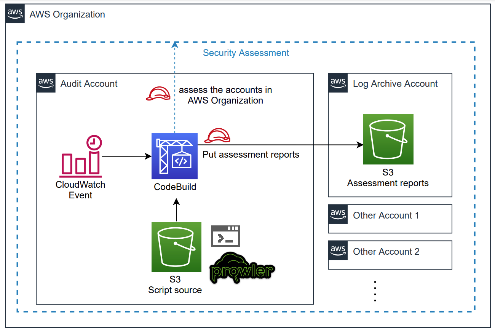
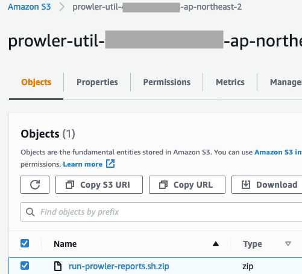

# Organizational Prowler with Serverless

Langage: [Korean](README_kr.md)

This project is created to apply prowler in a multi-account environment within AWS Organizations.
CloudWatch triggers CodeBuild every fixed time.
CodeBuild executes the script which clones the latest prowler from [here](https://github.com/prowler-cloud/prowler) and performs security assessment on all the accounts in AWS Organizations. The assessment reports are sent to S3 bucket in Log Archive Account.

For more information on how to use prowler, see [here](https://github.com/prowler-cloud/prowler#usage).

1. **Log Archive Account**
   1. Deploy [ProwlerS3.yaml](templates/ProwlerS3.yaml) in CloudFormation console.
      The template creates S3 bucket for reports and bucket policy that limits API actions to principals from its AWS Organizations.
      - AwsOrgId : AWS Organizations' Organization ID
      - S3Prefix : The prefix included in the bucket name
2. **Master Account**
   1. Deploy [ProwlerRole.yaml](templates/ProwlerRole.yaml) stack to CloudFormation in a bid to create resources to master account itself.
      (The template will be also deployed for other member accounts as a StackSet)
      - ProwlerCodeBuildAccount :  Audit Acccount ID where CodeBuild resides. (preferably Audit/Security account)
      - ProwlerCodeBuildRole : Role name to use in CodeBuild service
      - ProwlerCrossAccountRole : Role name to assume for Cross account
      - ProwlerS3 : The S3 bucket name where reports will be put
   1. Create **StackSet** with [ProwlerRole.yaml](templates/ProwlerRole.yaml) to deploy Role into member accounts in AWS Organizations.
      - ProwlerCodeBuildAccount :  Audit Acccount ID where CodeBuild resides. (preferably Audit/Security account)
      - ProwlerCodeBuildRole : Role name to use in CodeBuild service
      - ProwlerCrossAccountRole : Role name to assume for Cross account
      - ProwlerS3 : The S3 bucket name where reports will be put
      - Permission : Service-managed permissions
      - Deploy target : Deploy to organization 선택, Enable, Delete stacks 선택
      - Specify regions : Region to deploy
3. **Audit Account**
   1. Go to S3 console, create a bucket, upload [run-prowler-reports.sh.zip](src/run-prowler-reports.sh.zip)
      - bucket name : prowler-util-*[Account ID]*-*[region]*  
     

   1. Deploy  [ProwlerCodeBuildStack.yaml](templates/ProwlerCodeBuildStack.yaml) which creates CloudWatch Rule to trigger CodeBuild every fixed time, allowing prowler to audit multi-accounts.
      - AwsOrgId : AWS Organizations' Organization ID
      - CodeBuildRole : Role name to use in CodeBuild service
      - CodeBuildSourceS3 : Object location uploaded from i
         - prowler-util-*[Account ID]*-*[region]/**run-prowler-reports.sh.zip**
      - CrossAccountRole : Role name for cross account created in the process **2** above.
      - ProwlerReportS3 : The S3 bucket name where reports will be put
      - ProwlerReportS3Account : The account where the report S3 bucket resides.
   1. If you'd like to change the scheduled time,
      1. You can change the cron expression of ScheduleExpression within [ProwlerCodeBuildStack.yaml](templates/ProwlerCodeBuildStack.yaml).
      2. Alternatively, you can make changes directrly from Events > Rules > ProwlerExecuteRule > Actions > Edit in CloudWatch console.